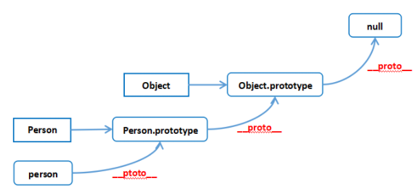
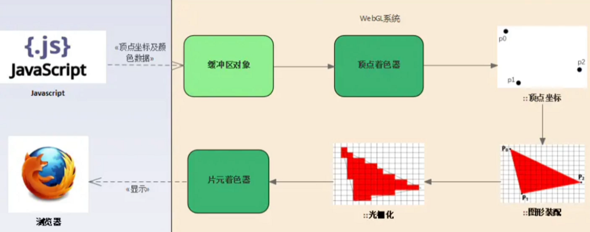
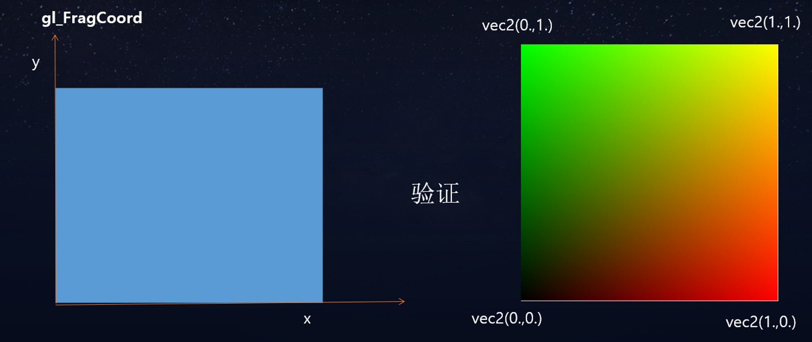
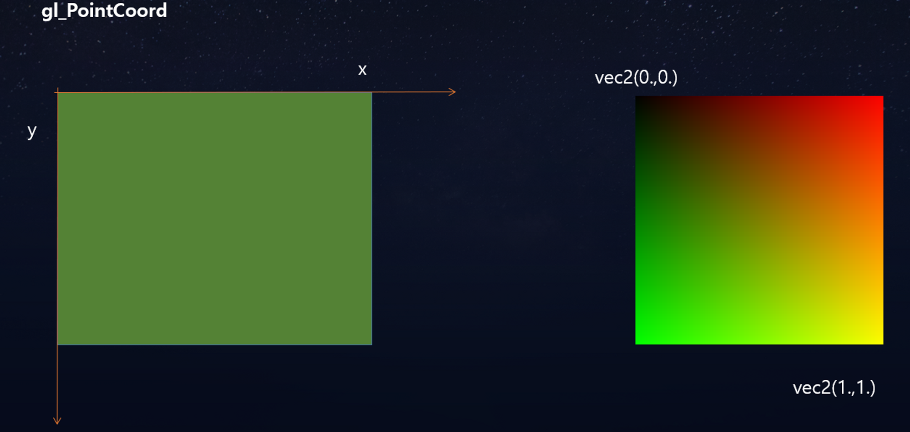

### vue 对比 react

- 相同点
  - 都是组件化思想
  - 都有虚拟dom
  - 都支持服务端渲染
- 不同点
  - react 单项数据流（MVC），vue 双向数据流（MVVM）
  - react 不可变数据，vue 可变数据
  - react 通过回调函数来进行通信，vue 通过 props 和 emit 来进行通信
  - react中事件是通过事件委托来实现的
  - diff 算法不同

### vue2 vs vue3

- 更好的tree-shaking,打包后体积更小,对ts支持更好
- 更接近原生
- 从options api 到 composition api
- vue2采用的是`defineProperty`来实现响应式，vue3采用的是`proxy`
- proxy 解决 数组和对象的响应式问题

### ES6
- set  map
  - set 无序不重复的集合 add() delete() has() clear()
  - map 键值对集合 map.set('foo', true) get() has() delete() clear()
- Promise  用于解决异步编程  将嵌套调用改为链式调用
  - 三种状态 pending fulfilled rejected
- Generator  生成器函数  用于异步编程
  - 通过`yield`关键字将函数分割成多段，每次调用`next()`方法执行一段代码
  - redux-saga 用的就是 generator
- 闭包  （警惕内存泄露）
  - 定义：指有权访问另一个作用中的变量，即使这个外部函数已经执行完毕 
  - 产生条件：1.函数嵌套 2.内部函数引用了外部函数的变量 3.外部函数被调用后返回的值是一个函数
  - 作用：保存函数的状态，封装变量，延长作用域
  
- 原型链
  - 当我们想查找一个变量身上的属性或者方法时
  - 可以顺着他的__proto__去寻找 直至为null
  - `__proto__ `是由构造函数的prototype派生而来  二者相等

- this
  - 优先级 new > 显示 > 隐式 > 默认
  - 修改this(显示)
    - applay 参数(指向，数组)
    - call 参数(指向，参数1，参数2，...)
    - bind 参数(指向，参数1，参数2，...)  但是不会立即执行
- 垃圾回收机制
  - 标记清除  维护一张表，记录哪些变量不再使用，然后回收它们的内存  速度慢 但是没有循环引用问题
  - 引用计数  当一个变量的引用次数为0时，就会被回收   无法解决循环引用的问题  速度快
- 本地存储
  - cookie 大小 4kb  用于存储少量数据，每次请求都会携带
  - localStorage 大小 5MB ~ 10MB  用于存储大量数据，不会携带
  - sessionStorage 大小 5MB ~ 10MB  用于存储大量数据，会话结束后清除
- 攻击方式
  - XSS 跨站脚本攻击 通过输入框等注入恶意脚本，获取用户信息
    - 一般框架都已经做了转义处理
  - CSRF 跨站请求伪造 通过伪造用户请求，进行恶意操作
    - 弃用cookie，使用JWT
- 回流 与 重绘
  - 回流：当页面布局和几何属性发生变化时，浏览器会重新渲染页面，称为回流
  - 重绘：当页面元素的绘制属性发生变化时，浏览器会重新渲染页面，称为重绘
  - 优化：
    - 尽量减少多次操作DOM 合并操作
    - 样式也是  如果样式较多 可以通过添加类名来一次性实现
- 响应式布局
  - 媒体查询  百分比 rem  vw/vh
- 垂直水平居中
  - flex  justify-content: center; align-items: center;
  - position  top: 50%; left: 50%; transform: translate(-50%, -50%);
  - position  top: 0 ; left: 0; right: 0; bottom: 0; margin: auto;
- css 优化
  - 异步加载css 
  - 资源压缩
  - 避免使用@import  因为 它会将多个css文件合并成一个
- 文字溢出 省略号
  - 单行  overflow: hidden; text-overflow: ellipsis; white-space: nowrap;
  - 多行  display: -webkit-box; -webkit-box-orient: vertical; -webkit-line-clamp: 3; overflow: hidden;
### webpack
- loader 与 plugin 区别
  - loader 用于对模块的源代码进行转换
  - plugin 用于扩展webpack的功能

### HTTP
- http 与 https 区别
 - https 更加安全，但性能不如 http，因为 https 需要加密解密以及多次握手
 - http 明文传输，https 加密传输
 - 二者使用的端口不同，http 80，https 443
- GET 与 POST 区别
  - GET 一般用于获取数据，POST 一般用于提交数据
  - GET 请求参数会显示在url上，POST 请求参数不会显示在url上
  - GET 请求参数有长度限制，POST 请求参数没有长度限制
- 从输入URL到浏览器渲染过程
  - DNS解析
  - 建立TCP连接
  - 发起HTTP请求
  - 服务器处理请求并返回HTTP报文
  - 浏览器解析渲染页面
  - 连接结束
- TCP 三次握手
  - 第一次 客户端发起
  - 第二次 服务端接收并发起  服务端确认收到
  - 第三次 客户端接收并发起  客户端确认收到
- TCP 四次挥手
  - 第一次 客户端 请求断开
  - 第二次 服务端接收并发起  服务端确认收到
  - 第三次 服务端 请求断开
  - 第四次 客户端接收并发起  客户端确认收到
### SPA single-page-application 单页面应用

- SPA  vs  MPA
  - SPA
    - 优点
      - 用户体验好，快，内容的改变不需要重新加载整个页面
      - 前后端分离，架构清晰，前端进行交互逻辑，后端负责数据处理
    - 缺点
      - SEO 难度较高
      - 初次加载耗时多
      - 前进后退路由管理
  - MPA
    - 优点
      - 初次加载快
      - SEO 较好
      - 后退前进管理
    - 缺点
      - 用户体验差，每次跳转都需要重新加载页面
      - 前后端耦合，开发效率低

### Vue

- 组件内的钩子函数
  - activated // keep-alive 缓存的组件激活时
  - deactivated // keep-alive 缓存的组件停用时调用
  - beforeRouteEnter
  - beforeRouteUpdate  // 例如从 /user/1 导航到 /user/2
  - beforeRouteLeave
- v-for 优先级高于 v-if  // 二者不能同时使用
- data为什么是一个函数
  - 保证每个组件实例都有自己的数据，防止组件之间数据相互影响
- 直接添加属性到实例上，不会触发更新
  - Vue.set( target, propertyName/index, value )
  - Object.assign()  // 拷贝并返回一个新对象
  - $forceUpdate()  // 强制更新
- 组件通信方法
  - `props` `$emit`
  - `ref`
  - `$parent` `$children`
  - `$attrs` `$listeners`
  - `provide` `inject`
  - `eventbus`   vue3已废弃  不利用代码阅读
  - `vuex`
- nextTick
  - 作用：在下次 DOM 更新循环结束之后执行延迟回调，可以理解为 vue更新DOM是异步执行的
- mixin 本质就是一个js对象，可以包含created，mounted等生命周期函数，也可以包含data，methods等选项
  - 优点
    - 可以抽离公共代码，减少重复代码
    - 可以在不同的组件中混入不同的选项
    - 提高代码的复用性
  - 缺点
    - 命名冲突
    - 难以维护
    - 污染全局变量
- slot 插槽
  - 匿名插槽 其实name为default
  - 具名插槽 name='xxx'   v-slot:xxx  #xxx
  - 作用域插槽 v-slot:xxx='props' #xxx="{props}"  // props为传递的数据 
- Vue.observable({ count : 1})
  - 小型的状态管理
- keepAlive
  - 用于组件缓存 一般搭配 router 来使用
  - 可以在配置路由表时 通过 meta 属性来配置缓存
  - 在router-view 获取$route.meta.keepAlive 来判断是否缓存
- 修饰符
  - lazy trim number stop native ...
- 过滤器 filter
  - 一般用来格式化单位，文本格式等  vue3 已废除
- SSR 解决的问题
  - SEO  以及  首屏加载优化
- 权限管理
  - 前端定义路由表，菜单由后端返回 动态渲染 
    - 渲染所有路由
    - 路由守卫控制是否有权限访问
    - 优点：可是实时获取最新权限
  - 菜单和路由都由后端返回
    - 一开始只渲染基础路由
    - 后端返回定义好路由组件的名称，前端通过名称拼接引入路由组件，然后addRoutes追加路由
    - 优点:只用请求一次，缺点：没有实时性
  - 按钮权限
    - 路由表中配置好 那些用户拥有按钮权限
    - 可以通过自定义指令 或者 mixin  混入按钮控制方案
- 双向绑定 mvvm
  - v-model vue2= v-bind:value + v-on:input  vue3= v-model:value + v-onUpdate:value
- key
  - +new Date() 可以做到强制刷新

### vue template

- template编译
  - 创建文档碎片，将模板中的内容一次性添加到文档碎片中
  - 解析模板中的指令和插值表达式，将指令对应的节点以及插值表达式对应的节点进行相应的处理，最终生成虚拟DOM
  - 创建  自更新 的方法 并将其保存到`watcher`中
  - 通过Object.defineProperty()方法将data中的数据转换成getter/setter，并在getter中收集依赖，在setter中触发依赖
  - 当data中的数据被访问时就将这个数据的更新方方法收集到watcher中，当数据被修改时就通知watcher更新视图
- diff 算法
  - oldStartIndex oldEndIndex newStartIndex newEndIndex
  - 新旧节点从前向后比较，相同更新，并且oldStartIndex,newStartIndex +1，不同跳出
  - 新旧节点从后向前比较，相同更新，并且oldEndIndex,newEndIndex -1，不同跳出
  - 旧开始节点对比 新结束节点  isSameVnode->patchVnode->将更新后的真实DOM移动到oldEndIndex之后->同时oldStartIndex+1,newEndIndex-1
  - 旧结束节点对比 新开始节点  isSameVnode->patchVnode->将更新后的真实DOM移动到oldStartIndex之前->同时oldEndIndex-1,newStartIndex+1
  - 如果都不是以上情况
    - 将新旧节点的剩余的vnode遍历生成由key作为键，idx作为值的对象(map结构)，然后新节点去旧节点中寻找相同节点
      - 找到了：patchVnode 并将该元素插入到oldStartIndex之前
      - 没找到就创建一个新的 并插入到对应位置
  - 比较完毕
    - 如果新节点有剩余 那么就追加并插入到旧末尾索引对应节点之前
    - 如果旧节点有剩余 直接删除多余的即可 

### React
- JSX-->createElement-->虚拟DOM-->真实DOM
  - babel-preset-react-app会将JSX转换成React.createElement()函数调用
  - createElement()函数会返回一个对象，这个对象就是虚拟DOM
  - render()函数会将虚拟DOM转换成真实DOM并渲染到页面中
- diff 算法
  - key和类型相同 更新并复用旧节点
  - key或类型不同 删除旧的，创建新的
  - 如果相同 经历两轮比较
  - 第一轮 主要处理节点更新 只要key不同，立即退出看是第二轮循环
  - 第二轮 主要是处理节点更新、新增、和移动
    - 根据Fiber链表来创建Map查询映射表(链表结构 在移动删除插入 性能高效)
    - key作为属性名 旧节点为属性值 新节点去旧节点中寻找，找到了就更新 并移动位置
  - 比较完毕 再来看是否有多余或者缺少
- 生命周期 
  - componentWillMount 
  - componentDidMount 
  - shouldComponentUpdate  useState
  - componentWillUpdate 
  - componentDidUpdate
  - componentWillReceiveProps 
  - componentWillUnMount
  - 父willMount->父render->子willMount->子render->子didMount->父didMount
- hooks 
  - useEffect(()=>{return{}}, []) 
  - 父传子  props={abc}   子组件中使用props.abc
  - 子传父  父组件给子组件传递一个函数，子组件调用这个函数并传递参数，这样就可以达到子组件给父组件传递参数
  - 在获取子组件时 不能直接ref.current获取，需要在子组件中使用forwardRef来包裹
- this 问题
  - 产生原因是react内部的合成事件
  - 方式一 显示绑定this  	onClick={this.handle.bind(this)}  handle(){console.log(this)}
  - 方式二 箭头函数 onClick={()=>{this.handle()}} handle(){console.log(this)}
  - 方式三 箭头函数 onClick={this.handle} handle=()=>{console.log(this)}
- CSS 样式私有化
  - Nav.module.css
  - react.jss
  - styled-components
- 优化相关
  - setState 在 react18中无论在哪里(包括定时器)都是异步操作,减少视图更新的次数 
  - PureComponent 它会自动给类组件添加一个shouldComponentUpdate方法 
  - 内部会自动对那个对新旧数据进行一个潜比较，如果没改变就不重新渲染视图 
  - memo 包裹函数组件能达到同样效果
  - 如果使用useState hooks它内部就实现了潜比较 
  - useMemo 类似于计算属性，依赖不改变就不会重新执行
- 组件通信 
  - createContext 
- 优化
  - useMemo 是用来缓存计算结果的，适用于那些需要根据依赖项进行复杂计算并且结果被频繁使用的场景。
  - useCallback 是用来记忆回调函数的，适用于那些需要将回调函数作为 prop 传递给子组件的场景。
- redux 流程 
  - 首先创建store 将reducer(存储着数据，以及更新方法)传递进入 
  - 通过react-redux 提供的Provider将store挂载到全局 
  - 定义actions(更新方法的类型)
  - 使用： 通过钩子函数useSelector来获取state,useDispatch来触发事件
  - hooks
    - useSelector 可以快速获取数据    const count = useSelector(state => state.count);
    - useDispatch 可以获取事件派发    const dispatch = useDispatch();
  - router 常用钩子函数
    - useParams 获取路由参数
    - useSearchParams 获取路由参数
    - useLocation 获取路由信息
    - useNavigate 可以实现路由跳转
- 如何实现跨域
  - eject暴露出webpack配置->它读取的是 src/setupProxy.js
  - 使用中间件 http-proxy-middleware 来处理即可
#### 首屏加载优化  First Contentful Paint

- 优化方案
  - 减小入口文件体积  路由懒加载
  - 本地缓存静态资源  采用HTTP缓存，设置Cache-Control，Last-Modified，Etag等响应头
  - UI框架按需加载 tree shaking
  - 图片资源压缩
  - 开启gzip压缩
  - 服务端渲染SSR

polyfill 用于实现浏览器不支持原生功能的代码 // 例如：babel-polyfill

- token 过期无痛刷新
  - 方案一：
  - 后端返回token过期时间，前端在每次请求前判断 
  - 发现过期 先将请求挂载 并发起请求刷新token 后重新执行挂载的请求
  - 缺点： 本地时间 与 服务器时间不一致
  - 方案二：
  - 在响应拦截器中拦截token过期
  - 发现过期重新请求 并将失败的请求重新发送一次

webgl
- 从CPU给GPU传递数据
  - uniform 顶点着色器和片元着色器中都可直接使用  一般用于传递一个变量 uTime...
  - attribute 只存在于顶点着色器  一般用于每个顶点的数据(Float32Array) aPosition ...
```
  this.bufferGeometry = new THREE.BufferGeometry();
  this.material = new THREE.ShaderMaterial({
    vertexShader,
    fragmentShader,
    uniforms: {
      progress: {value: 0}, // 进度
    },
  });
  this.position = new Float32Array(this.pointNumber * 3); // 三个参数表示一个点的坐标
  this.bufferGeometry.setAttribute('position', new THREE.BufferAttribute(this.position, 3));
```

- 缓冲区对象
  - 创建缓存区对象->绑定缓冲区对象->写入数据->将缓冲区对象分配给一个attribute->应用attribute
  - 优点：可以一次性向着色器中传递多个顶点数据，减少重复的点个数

- 渲染步骤
  - js->创建缓冲区对象->顶点着色器->渲染顶点坐标(裁剪)->图形装配->光栅化(转为图像上的像素点)->片元着色器->浏览器展示


- 矩阵变换  gl 中是列主序的  右手法则
  - 现在已经有很多库包帮我们实现了矩阵变换  只需要会用即可


- 纹理坐标系 uv
  - 原点在左下角
- 法向量
  - 物体表面朝向 即垂直与表面的方向 又称法线或者法向量
- gl_FragCoord 片元在canvas画布坐标系中的坐标，左下角为原点

- gl_PointCoord 光栅化后的片元，表示的坐标就是gl_PointSize定义的区域内的片元坐标，左上角为原点


- vertex 顶点着色器 
  - 注意顺序不能错  矩阵是没有交换律的
  - gl_Position = projectionMatrix * viewMatrix * modelMatrix * vec4(position,1.0);
  - gl_Position = projectionMatrix * modelViewMatrix * vec4(pos, 1.0); // 从右向左看
  - 投影矩阵 模型矩阵(mesh位置) 视图(相机)矩阵 geometry位置(他都是相对于mesh位置而言的)
- fragment 片元着色器
  - gl_FragColor = vec4(1.0,0.0,0.0,1.0);

- 如何将贴图传给片元着色器
```
const texture = new THREE.TextureLoader().load('./textures/wallhaven-rrodj7.jpg');
const material = new THREE.ShaderMaterial({
  vertexShader,
  fragmentShader,
  uniforms: {
    uTexture: {
      value: texture
    }
  }
});
// 顶点着色器将uv传递给片元着色器
varying vec2 vUv;
void main() {
  ...
  vUv = uv;
}
uniform sampler2D uTexture;
varying vec2 vUv;
void main() {
  vec4 uTextureColor = texture2D(uTexture, vUv);
  gl_FragColor = uTextureColor;
}
```

- 使用射线时 将鼠标坐标范围转为 -1 ~ 1
  ```
  const mouse = new THREE.Vector2();
	const raycaster = new THREE.Raycaster();
	window.addEventListener('click', (ev) => {
		mouse.x = (ev.clientX / window.innerWidth) * 2 - 1;
		mouse.y = -((ev.clientX / window.innerWidth) * 2 - 1);
		raycaster.setFromCamera(mouse, cameraModule.activeCamera);
		const intersects = raycaster.intersectObject(this.flightGroup!);
    // ...
	});
  ```
- 先进行线性变化 在进行平移变化 由于平移变换比较特殊 所以引入了齐次坐标  

- threejs 常见特效
  - 可以通过mesh.material.onBeforeCompile 钩子函数 来修改默认shader
  - 模型 粒子化
    - traverse模型就能获取它子模块的位置 创建shader
    - THREE.Point() 应用即可 
    - 爆炸其实就是改变 粒子位置 搭配gsap
  - 雷达扫描
    - PlaneGeometry  然后通过step+distance变成圆形
    - 根据uTime动态旋转这个物体，通过uv设置旋转中心点
    - 通过点所在角度来设置透明度 形成雷达扫描效果
  - 添加精灵图图标
    - 只要要创建材质加贴图就完事了
    - new THREE.Sprite(material)
  - 飞线
    - 可以直接通过纹理偏移  也可以通过shader来实现
  ```
  // 创建曲线
	this.lineCurve = new THREE.CatmullRomCurve3(linePoints);
	// 根据曲线生成管道几何体
	this.geometry = new THREE.TubeGeometry(this.lineCurve, 100, 0.4, 2, false);
  this.material = new THREE.MeshBasicMaterial({
		color: 0xfff000,
		map: this.texture,
		transparent: true,
	});
	// 创建飞线对象
	this.mesh = new THREE.Mesh(this.geometry, this.material);
  // 创建飞线动画, 原理就是通过 偏移纹理来实现动画
	gsap.to(this.texture.offset, {
		x: -1,
		duration: 3,
		repeat: -1,
		ease: 'none',
	});
  ```
threejs性能优化
- gltf-pipeline 压缩模型
- 多使用clone方法
- 用不到的模型dispose销毁掉
- 使用BufferGeometry
- 模型减少顶点面数，降低模型精度，使用gltf or glb
- indexedDB 存储模型  
- websocket将一些计算放到后台执行
- 只打开需要的阴影，利用视锥体剔除不可见物体

- 相机 （正交投影  透视投影）
  - 透视相机  夹角 画布宽高比 近切面 远切面
- 灯光
  - 环境光 点光源 平行光 聚光灯
- 材质
  - MeshBasicMaterial 基础网格材质 不受光照影响
  - MeshStanderMaterial 标砖网格材质 受光照影响
- 纹理
  - map 基本纹理
  - alphaMap 透明纹理 需要开启材质透明 transparent: true
  - aoMap 环境遮挡贴图 需要设置第二组uv
  - displacementMap 置换贴图(层次感)
  - roughnessMap 粗糙度贴图
  - metalnessMap 金属度贴图
- 阴影(只有这几种能产生阴影 PointLight DirectionLight SpotLight)  四步走
  - 渲染器开启阴影  renderer.shadowMap.enabled = true
  - 灯光开启阴影  directionLight.castShadow = true
  - 物体投射阴影  sphere.castshadow = true;
  - 物体接收阴影  plane.receiveshadow = true;
- 射线碰撞检测
  - 从相机位置发射一条到目标位置的射线
  - 通过 raycaster.intersectObjects 来判断是否存在碰撞
  - 常用在 物体遮挡label展示隐藏
- 创建曲线 curve 路线回放
  - const curve = new THREE.CatmullRomCurve3([几个点,会自动插值],true) // 参数二 表示起始点位闭合
  - curve.getPoints(50) 从曲线中获取更多个数的点
  - geometry = new THREE.BufferGeometry().setFromPoints(points) // 然后就可以通过这些点创建物体
  - 接着可以 通过帧函数 来动态获取在线段上的位置 并copy给物体 以达到路线回放的功能
- 移除物体
  - mesh.remove();
  - mesh.removeFromParent();
  - mesh.geometry.dispose();
  - mesh.material.dispose();
- 锁定相机视角(看向谁) camera.lookAt(xxx.position)  controls.target.set(x,y,z)
- 通过group来统一管理子元素 方便控制显隐
- 物理引擎 
  - cannon-es  rapier
- dat.gui  调试插件  GSAP 动画补帧插件
- stats.js 帧率检测
- 时钟 clock = new THREE.Clock()
  - clock.getDelta() // 两帧间隔时间
  - clock.getElapsedTime() // 时钟运行总时长

- 如何封装一个优秀的组件
  - 需求分析 （确定组件的设计规范和用途，分析可能的交互场景）
  - 设计阶段 （设计组件结构、扩展性）
  - 开发阶段 （包括UI界面、交互逻辑、数据处理，编写文档等）
  - 测试阶段 （性能测试等）
  - 优化和调试
  - 维护和更新

- JS异步编程
  - 异步编程指的是在代码执行中不阻塞后续代码而继续执行其他任务的一种变成方式
  - 这种方式的出现是为了解决JS单线程时可能遇到长时间任务阻塞的问题
  - **核心思想**：事件循环来处理 (Promise、async/await、Generator)
