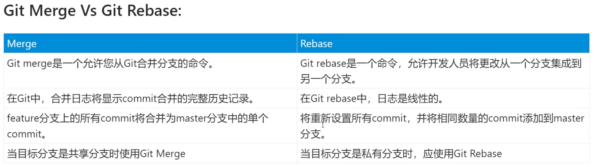
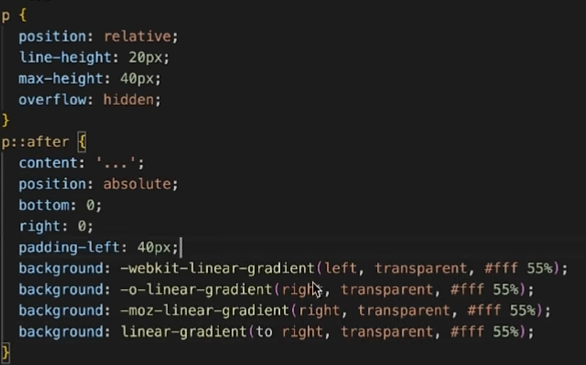
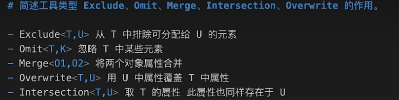

### 自我介绍
你好，我叫xxx，25岁，本科学历；
至今已经从事前端开发三年多了
我目前在一家软件公司从事前端开发，曾独立负责过多个系统以及模块的开发，包括web端和移动端
我的主要技术栈有：vue2 vue3 react18 uniapp 及其生态工具
擅长开发的项目类型有：数据可视化、管理后台、门户等
除此之外 我对threejs cesium 也有一定了解 可以进行一些3d场景开发以及gis地图开发
最后，我还擅长使用ai工具来提升工作效率，比如copilot chatgpt等

- 使用TS的好处
  - 严格的类型检查
  - 提升代码的可读性与维护性
  - 智能的代码补全和提示
  - 更好的团队合作
  - 兼容js代码

- merge 与 rebase
  - merge 一般用于将其他分支合并到主分支
    - Merge（合并）是将两个分支上的代码提交历史合并为一个新的提交
  - rebase 一般用于将主分支最新代码合并到我们的个人分支上
    - Rebase（变基）是将一个分支上的提交逐个地应用到另一个分支上，使得提交历史变得更加线性


- 架构
  - 需求分析和业务理解
  - 技术选型
  - 项目目录结构设计（开发规范、版本管理、文件命名等）
  - 模块化设计（根据业务拆分模块）
  - 状态管理和数据流设计
  - 性能优化 （懒加载、缓存、资源压缩等）
  - 安全性设计
  - 文档编写和团队培训

### vue 对比 react

- 相同点
  - 都是组件化思想
  - 都有虚拟dom
  - 都支持服务端渲染
  - 单项数据流
- 不同点
  - 核心思想层面
    - react 核心思想是声明式渲染和组件化，它既不属于MVC也不属于MVVM架构，vue是 （MVVM）
    - react没有viewModel所以不算MVVM
    - 在MVC中，Controller负责接收用户的输入，并更新Model，但react中没有明确的Controller，组件直接处理用户的输入 ，并更新自身的状态和呈现
  - 模板语法层面
    - vue模板引擎 react是JSX
  - 数据绑定层面
    - react 不可变数据，vue 可变数据
    - react 通过回调函数来进行通信，vue 通过 props 和 emit 来进行通信
    - react中事件是通过事件委托来实现的
  - css层面
    - vue支持scoped来实现样式隔离，react则是css-in-js
  - diff 算法不同


### vue2 vs vue3

- 更好的tree-shaking,打包后体积更小,对ts支持更好
- 更接近原生
- 从options api 到 composition api
- vue2采用的是`defineProperty`来实现响应式，vue3采用的是`proxy`
- proxy 解决 数组和对象的响应式问题

### ES6
- set  map
  - set 无序不重复的集合 add() delete() has() clear()
  - map 键值对集合 map.set('foo', true) get() has() delete() clear()
- Promise  用于解决异步编程  将嵌套调用改为链式调用
  - 一旦状态改变，就无法再被改变
  - 三种状态 pending fulfilled rejected
  - 静态方法：resolve reject all race allSettled any
    - allSettled 它接收一个包含多个 Promise 对象的可迭代对象，并返回一个新的 Promise 对象，该 Promise 对象在所有给定的 Promise 对象都已经被解析或被拒绝后才会解析。与 Promise.all() 不同的是，Promise.all() 会在任何一个给定的 Promise 对象被拒绝时立即返回并且拒绝整个 Promise。而 Promise.allSettled() 会等待所有 Promise 对象都被解析或拒绝后才会返回结果，无论 Promise 对象的状态是解析还是拒绝。
  - 无法取消
- Promise值穿透问题
  - .then .catch 期望是一个函数，当传入的是非函数则会发生值穿透
  ```javascript
  Promise.resolve(1).then(2).then(Promise.resolve(3)).then(console.log); // 1
  // promise 的data将会保存上一个promise.data原因resolved
  ```
- Generator  生成器函数  用于异步编程 返回一个迭代器
  - 通过`yield`关键字将函数分割成多段，每次调用`next()`方法执行一段代码
  - redux-saga 用的就是 generator
- 回调函数（Callback） 例如：setTimeout 也可以用于异步编程
- 闭包  （警惕内存泄露）
  - 定义：指的是能够访问其词法作用域外部变量的函数，即使这个外部函数已经执行完毕，换句话说，闭包使函数能够“记住”自己创建时的作用域，并在稍后的执行过程中继续访问这个作用域。
  - 产生条件：1.函数嵌套 2.内部函数引用了外部函数的变量 3.外部函数被调用后返回的值是一个函数
  - 作用：保存函数的状态，创建私有变量和函数，延长变量的生命周期
  
- 原型链
  - 当我们想查找一个变量身上的属性或者方法时
  - 可以顺着他的__proto__去寻找 直至为null
  - `__proto__ `是由构造函数的prototype派生而来  二者相等
  - `prototype` 是函数对象特有的属性，每一个函数对象都有 `prototype` 属性。它用来指向该函数的原型对象，在使用 new 操作符创建对象实例时，会将原型对象赋值给实例对象的 `__proto__ `属性。
  - `__proto__` 是每个对象（包括函数对象）都具有的内部属性，用来指向该对象的原型。可以通过 `__proto__` 属性来访问和修改对象的原型链。

- this (一般来说谁调用，this就指向谁)
  - 优先级 new > 显示 > 隐式 > 默认
  - 修改this(显示)
    - applay 参数(指向，数组)
    - call 参数(指向，参数1，参数2，...)
    - bind 参数(指向，参数1，参数2，...)  但是不会立即执行
- 垃圾回收机制（内存泄露）
  - 标记清除  维护一张表，记录哪些变量不再使用，然后回收它们的内存  速度慢 但是没有循环引用问题
  - 引用计数  当一个变量的引用次数为0时，就会被回收   无法解决循环引用的问题  速度快
- 本地存储
  - cookie 大小 4kb  用于存储少量数据，每次请求都会携带
  - localStorage 大小 5MB ~ 10MB  用于存储大量数据，不会携带
  - sessionStorage 大小 5MB ~ 10MB  用于存储大量数据，会话结束后清除
- 攻击方式
  - XSS 跨站脚本攻击 通过输入框等注入恶意脚本，获取用户信息
    - 一般框架都已经做了转义处理
  - CSRF 跨站请求伪造 通过伪造用户请求，进行恶意操作
    - 弃用cookie，使用JWT
- 回流 与 重绘
  - 回流：当页面布局和几何属性发生变化时，浏览器会重新渲染页面，称为回流
  - 重绘：当页面元素的绘制属性发生变化时，浏览器会重新渲染页面，称为重绘
  - 优化：
    - 尽量减少多次操作DOM 合并操作
    - 样式也是  如果样式较多 可以通过添加类名来一次性实现
- 响应式布局
  - 媒体查询  百分比 rem  vw/vh
- 垂直水平居中
  - flex  justify-content: center; align-items: center;
  - position  top: 50%; left: 50%; transform: translate(-50%, -50%);
  - position  top: 0 ; left: 0; right: 0; bottom: 0; margin: auto;
- flex:1 等于
  - 浏览器默认为flex容器的子元素设置了 "min-width: auto;min-height: auto"，这意味着子元素的最小宽度和高度不能小于其内容的宽度和高度。
  - flex-grow:1;  占剩余空间的比例 
  - flex-shrink:1; 是否缩小
  - flex-basis:auto; 基础大小
- css 优化
  - css不会阻塞dom树解析，但是会阻塞dom树渲染，并且会阻塞后续js语句执行
  - 使用cdn
  - 合理使用缓存 更新文件需要改变其hash
  - 异步加载css 
  - 资源压缩 gzip
  - 合理使用选择器 减少使用高权重选择器 
  - 较少发出http请求 内联关键css
  - 避免使用@import  因为 它会将多个css文件合并成一个
- 文字溢出 省略号
  - 单行  overflow: hidden; text-overflow: ellipsis; white-space: nowrap;
  - 多行  display: -webkit-box; -webkit-box-orient: vertical; -webkit-line-clamp: 3; overflow: hidden;
  - 兼容性 如下图，可以利用后置伪元素...，然后其他的直接隐藏即可


### webpack
- entry构建入口
- output 输出的方式
- chunk 将一些代码打包成一个单独的文件，实现单独加载
- loader 与 plugin 区别
  - loader 用于对模块的源代码进行转换
  - plugin 用于扩展webpack的功能 例如 html-webpack-plugin

### HTTP
- http 与 https 区别
 - https 更加安全，但性能不如 http，因为 https 需要加密解密以及多次握手
 - http 明文传输，https 加密传输
 - 二者使用的端口不同，http 80，https 443
- 常见状态码
  - 200 OK
  - 304 协商缓存
  - 400 发出的请求有错误
  - 401 没有权限
  - 403 禁止访问
  - 404 发出的请求要获取的资源不存在
  - 500 服务器内部错误
  - 502 网关错误
- GET 与 POST 区别
  - GET 一般用于获取数据，POST 一般用于提交数据
  - GET 请求参数会显示在url上，POST 请求参数不会显示在url上
  - GET 请求参数有长度限制，POST 请求参数没有长度限制
- axios
  - 底层是 XMLHttpRequest
  - 支持promise API
  - 客户端支持防止CSRF（同源策略、自定义请求头、CSRF Token、预检请求）
    - 预检请求（Preflight Request）作用：确定是否允许跨域请求，从而保障跨域请求的安全性和可靠性。
  - node端也可以使用
  - 拦截请求和处理响应
  - 转换请求和响应数据
  - 取消请求
  - 自动转换JSON数据
- 从输入URL到浏览器渲染过程
  - 首先会查找 浏览器缓存-系统缓存-路由器缓存
    - 如果有缓存则直接显示页面内容
  - DNS解析
  - 建立TCP连接 三次握手
  - 发起HTTP请求
  - 服务器处理请求并返回HTTP报文
  - 浏览器解析渲染页面 
    -  生成dom树 解析css样式 js交互 渲染
- TCP 三次握手
  - 第一次 客户端发起
  - 第二次 服务端接收并发起  服务端确认收到
  - 第三次 客户端接收并发起  客户端确认收到
- TCP 四次挥手
  - 第一次 客户端 请求断开
  - 第二次 服务端接收并发起  服务端确认收到
  - 第三次 服务端 请求断开
  - 第四次 客户端接收并发起  客户端确认收到
### SPA single-page-application 单页面应用

- SPA  vs  MPA
  - SPA
    - 优点
      - 用户体验好，快，内容的改变不需要重新加载整个页面
      - 前后端分离，架构清晰，前端进行交互逻辑，后端负责数据处理
    - 缺点
      - SEO 难度较高
      - 初次加载耗时多
      - 前进后退路由管理
  - MPA
    - 优点
      - 初次加载快
      - SEO 较好
      - 后退前进管理
    - 缺点
      - 用户体验差，每次跳转都需要重新加载页面
      - 前后端耦合，开发效率低

### Vue

- 组件内的钩子函数
  - activated // keep-alive 缓存的组件激活时
  - deactivated // keep-alive 缓存的组件停用时调用
  - beforeRouteEnter
  - beforeRouteUpdate  // 例如从 /user/1 导航到 /user/2
  - beforeRouteLeave
  - errorCaptured // 捕获由组件树中任何位置触发的错误，并处理它们
- v-for 优先级高于 v-if  // 二者不能同时使用
  - 每次渲染都会先循环再进行条件判断
  - `<template v-if="isShow">  <p v-for="item in items">  </template>`
- data为什么是一个函数
  - 保证每个组件实例都有自己的数据，防止组件之间数据相互影响
- 直接添加属性到实例上，不会触发更新
  - Vue.set( target, propertyName/index, value )
  - Object.assign()  // 拷贝并返回一个新对象
  - $forceUpdate()  // 强制更新
- 错误捕获
  - 网络错误就使用 apiClient.interceptors.response
  - 其他错误 Vue.config.errorHandler = function(err, vm, info){}
- 组件通信方法
  - `props` `$emit`
  - `ref`
  - `$parent` `$children`
  - `$attrs` `$listeners`
  - `provide` `inject`
  - `eventbus`   vue3已废弃  不利用代码阅读
  - `vuex`
- 单一数据流是一种前端架构设计模式，它的核心思想是整个应用的状态被存储在单一的数据源中，并且应用的状态只能通过固定的方式进行修改。
  - state getters mutations actions
- nextTick
  - 作用：在下次 DOM 更新循环结束之后执行延迟回调，可以理解为 vue更新DOM是异步执行的
- Vue3常用生命周期
  - onBeforeMount onMounted onBeforeUnmount onUnmounted onBeforeUpdate onUpdated onActivated onDeactivated
- mixin 本质就是一个js对象，可以包含created，mounted等生命周期函数，也可以包含data，methods等选项
  - 优点
    - 可以抽离公共代码，减少重复代码
    - 可以在不同的组件中混入不同的选项
    - 提高代码的复用性
  - 缺点
    - 命名冲突
    - 难以维护
    - 污染全局变量
- slot 插槽
  - 匿名插槽 其实name为default
  - 具名插槽 name='xxx'   v-slot:xxx  #xxx
  - 作用域插槽 v-slot:xxx='props' #xxx="{props}"  // props为传递的数据 
- Vue.observable({ count : 1})
  - 小型的状态管理
- keepAlive
  - 用于组件缓存 一般搭配 router 来使用
  - 可以在配置路由表时 通过 meta 属性来配置缓存
  - 在router-view 获取$route.meta.keepAlive 来判断是否缓存
- 修饰符
  - lazy trim number stop native ...
- 过滤器 filter
  - 一般用来格式化单位，文本格式等  vue3 已废除
- SSR 解决的问题
  - SEO  以及  首屏加载优化
- 权限管理
  - 前端定义路由表，菜单由后端返回 动态渲染 
    - 渲染所有路由
    - 路由守卫控制是否有权限访问
    - 优点：可是实时获取最新权限
  - 菜单和路由都由后端返回
    - 一开始只渲染基础路由
    - 后端返回定义好路由组件的名称，前端通过名称拼接引入路由组件，然后addRoutes追加路由
    - 优点:只用请求一次，缺点：没有实时性
  - 按钮权限
    - 路由表中配置好 那些用户拥有按钮权限
    - 可以通过自定义指令 或者 mixin  混入按钮控制方案
- 双向绑定 mvvm
  - v-model vue2= v-bind:value + v-on:input  vue3= v-model:value + v-onUpdate:value
- key
  - +new Date() 可以做到强制刷新

### vue template

- template编译
  - 通过Object.defineProperty()方法将data中的数据转换成getter/setter，并在getter中收集依赖，在setter中触发依赖
  - 当data中的数据被访问时就将这个watcher实例收集到dep.subs中，当数据被修改时就通知dep.notify更新视图
  - 1.将data中的数据转换成getter/setter
  - 2.解析模板中的指令和插值表达式，直接获取根元素，然后通过递归+正则的方式将根元素中的所有节点进行解析，最终生成虚拟DOM，并创建自更新方法，将其封装成一个watcher类(包含vm,key,update)
  - 3.将虚拟DOM转换成真实DOM，并插入到页面中
  - 4.调用Observer类，在getter中收集依赖addSub，在setter中触发依赖notify
  - 视图自动更新，没有明显的触发动作，所以算观察者模式
- diff 算法  仅在同级比较 (节点类型与key相同才会进行更新，不同则直接删除)
  - oldStartIndex oldEndIndex newStartIndex newEndIndex
  - 新旧节点从前向后比较，相同更新，并且oldStartIndex,newStartIndex +1，不同跳出
  - 新旧节点从后向前比较，相同更新，并且oldEndIndex,newEndIndex -1，不同跳出
  - 旧开始节点对比 新结束节点  isSameVnode->patchVnode->将更新后的真实DOM移动到oldEndVnode之后->同时oldStartIndex+1,newEndIndex-1
  - 旧结束节点对比 新开始节点  isSameVnode->patchVnode->将更新后的真实DOM移动到oldStartVnode之前->同时oldEndIndex-1,newStartIndex+1
  - 如果都不是以上情况
    - 将新旧节点的剩余的vnode遍历生成由key作为键，index作为值的对象(哈希表中)，然后新节点去旧节点中寻找相同节点
      - 找到了：patchVnode 并将该元素插入到oldStartVnode之前
      - 没找到就创建一个新的 并插入到对应位置
    - 通过 oldStartIndex > oldEndIndex ，来判断 旧节点 和 新节点 哪一个先遍历完成
      - `旧节点` 先遍历完成,则证明 `新节点` 还有多余节点，需要新增这些节点
      - `新节点` 先遍历完成,则证明 `旧节点` 还有多余节点，需要删除这些节点
    

### React
- JSX-->createElement-->虚拟DOM-->真实DOM
  - babel-preset-react-app会将JSX转换成React.createElement()函数调用
  - createElement()函数会返回一个对象，这个对象就是虚拟DOM
  - vdom生成Fiber对象
  - render()函数会将虚拟DOM转换成真实DOM并渲染到页面中
- diff 算法
  - 深度优先，同层比较
  - key和类型相同 更新并复用旧节点
  - key或类型不同 删除旧的，创建新的
  - 如果相同 经历两轮比较
  - 第一轮 主要处理节点更新 遍历Fiber链表去virtualDOM中从前到后寻找新节点
    -  key相同
       -  标签内容相同 直接复用
       -  标签相同内容不同 更新
       -  标签不同 删除旧的创建新的
    -  key不同 直接跳出循环
  - 第二轮 主要是处理节点更新、新增、和移动
    - 创建Map查询映射表(链表结构 在移动删除插入 性能高效)
    - key作为属性名 旧节点为属性值 新节点去旧节点中寻找，找到了就更新 并移动位置
  - 比较完毕 再来看是否有多余或者缺少
- 生命周期 
  - constructor 
  - componentWillMount 
  - render
  - componentDidMount 
  - shouldComponentUpdate  useState
  - componentWillUpdate 
  - componentDidUpdate
  - componentWillReceiveProps 
  - componentWillUnMount
  - 父willMount->父render->子willMount->子render->子didMount->父didMount
- 常用hooks
  - useState useMemo useCallback useReducer useContext useRef useEffect 
- state 与 props 区别
  - 相同点
    - 二者都是js对象
    - 二者都是用于保存信息
    - props和state都能触发渲染更新
  - 区别
    - props是父组件传递过来的，state是组件内部的
    - props是只读的，state是可读写的
- 受控组件
  - 大部分时候推荐使用受控组件来实现表单，因为在受控组件中，表单数据由React组件负责处理
- 高阶组件
  - 高阶组件即接受一个或多个组件作为参数并且返回一个组件，本质也就是一个函数，并不是一个组件
  - 主要功能是封装并分离组件的通用逻辑，让通用逻辑在组件间更好地被复用
    - props 保持一致
    - 你不能在函数式（无状态）组件上使用 ref 属性，因为它没有实例
    - 不要以任何方式改变原始组件 WrappedComponent
    - 透传不相关 props 属性给被包裹的组件 WrappedComponent
    - 不要再 render() 方法中使用高阶组件
    - 使用 compose 组合高阶组件
    - 包装显示名字以便于调试
- hooks 
  - useEffect(()=>{}, []) 
    - 如果返回一个函数 那个函数中数据都是上次更新的，可用于处理副作用等
  - 父传子  props={abc}   子组件中使用props.abc
  - 子传父  父组件给子组件传递一个函数，子组件调用这个函数并传递参数，这样就可以达到子组件给父组件传递参数
  - 在获取子组件时 不能直接ref.current获取，需要在子组件中使用forwardRef来包裹
- this 问题
  - 产生原因是react内部的合成事件
  - 方式一 显示绑定this  	onClick={this.handle.bind(this)}  handle(){console.log(this)}
  - 方式二 箭头函数 onClick={()=>{this.handle()}} handle(){console.log(this)}
  - 方式三 箭头函数 onClick={this.handle} handle=()=>{console.log(this)}
- CSS 样式私有化
  - Nav.module.css
  - react.jss
  - styled-components
- 优化相关 (代码层面、工程层面、框架机制层面)
  - setState 在 react18中无论在哪里(包括定时器)都是异步操作,减少视图更新的次数 
  - PureComponent 它会自动给类组件添加一个`shouldComponentUpdate`方法 
  - 内部会自动对那个对新旧数据进行一个潜比较，如果没改变就不重新渲染视图 
  - memo 包裹函数组件能达到同样效果
  - 如果使用useState hooks它内部就实现了潜比较 
  - useMemo 类似于计算属性，依赖不改变就不会重新执行
  - 避免使用内敛函数
  - 使用Fragement
  - 使用immutable.js
  - useCallback 可以用来优化函数的性能，并在需要传递回调函数给子组件或作为副作用处理程序时非常有用。值得注意的是，需要谨慎地选择依赖项，以确保使用 useCallback 确实带来了性能提升，而不是额外的开销。
- 优化
  - useMemo 是用来缓存计算结果的，适用于那些需要根据依赖项进行复杂计算并且结果被频繁使用的场景。
  - useCallback 是用来记忆回调函数的，适用于那些需要将回调函数作为 prop 传递给子组件的场景。
  - 避免使用内联函数、使用immutable、React Fragments 、组件懒加载、服务端渲染
- react事件机制（抹平不同浏览器之间的差异）
  - v16事件绑定在document上 v17事件绑定在组件上
  - React 上注册的事件最终会绑定在document这个 DOM 上，而不是 React 组件对应的 DOM(减少内存开销就是因为所有的事件都绑定在 document 上，其他节点没有绑定事件)
  - React 自身实现了一套事件冒泡机制，所以这也就是为什么我们 event.stopPropagation()无效的原因。
  - e.nativeEvent 获取原生事件对象
  - React 通过队列的形式，从触发的组件向父组件回溯，然后调用他们 JSX 中定义的 callback
  - React 有一套自己的合成事件 SyntheticEvent
- redux 流程 
  - 首先创建store 将reducer(存储着数据，以及更新方法)传递进入 
  - 通过react-redux 提供的Provider将store挂载到全局 
  - 定义actions(更新方法的类型)
  - 使用： 通过钩子函数useSelector来获取state,useDispatch来触发事件
  - hooks
    - useSelector 可以快速获取数据    const count = useSelector(state => state.count);
    - useDispatch 可以获取事件派发    const dispatch = useDispatch();
  - router 常用钩子函数
    - useParams 获取路由参数
    - useSearchParams 获取路由参数
    - useLocation 获取路由信息
    - useNavigate 可以实现路由跳转
- 如何实现跨域
  - eject暴露出webpack配置->它读取的是 src/setupProxy.js
  - 使用中间件 http-proxy-middleware 来处理即可
#### 首屏加载优化  First Contentful Paint

- 优化方案
  - 减小入口文件体积  路由懒加载
  - 本地缓存静态资源  采用HTTP缓存，设置Cache-Control，Last-Modified，Etag等响应头
  - UI框架按需加载 tree shaking
  - 图片资源压缩
  - 开启gzip压缩
  - 服务端渲染SSR

- polyfill 用于实现浏览器不支持原生功能的代码 // 例如：babel-polyfill
  - @babel/preset-env

- token 过期无痛刷新
  - 方案一：
  - 后端返回token过期时间，前端在每次请求前判断 
  - 发现过期 先将请求挂载 并发起请求刷新token 后重新执行挂载的请求
  - 缺点： 本地时间 与 服务器时间不一致
  - 方案二：
  - 在响应拦截器中拦截token过期
  - 发现过期重新请求 并将失败的请求重新发送一次

webgl
- 从CPU给GPU传递数据
  - uniform 顶点着色器和片元着色器中都可直接使用  一般用于传递一个变量 uTime...
  - attribute 只存在于顶点着色器  一般用于每个顶点的数据(Float32Array) aPosition ...
```
  this.bufferGeometry = new THREE.BufferGeometry();
  this.material = new THREE.ShaderMaterial({
    vertexShader,
    fragmentShader,
    uniforms: {
      progress: {value: 0}, // 进度
    },
  });
  this.position = new Float32Array(this.pointNumber * 3); // 三个参数表示一个点的坐标
  this.bufferGeometry.setAttribute('position', new THREE.BufferAttribute(this.position, 3));
```

- 缓冲区对象
  - 创建缓存区对象->绑定缓冲区对象->写入数据->将缓冲区对象分配给一个attribute->应用attribute
  - 优点：可以一次性向着色器中传递多个顶点数据，减少重复的点个数

- 渲染步骤
  - js->创建缓冲区对象->顶点着色器->渲染顶点坐标(裁剪)->图形装配->光栅化(转为图像上的像素点)->片元着色器->浏览器展示


- 矩阵变换  gl 中是列主序的  右手法则
  - 现在已经有很多库包帮我们实现了矩阵变换  只需要会用即可


- 纹理坐标系 uv
  - 原点在左下角
- 法向量
  - 物体表面朝向 即垂直与表面的方向 又称法线或者法向量
- gl_FragCoord 片元在canvas画布坐标系中的坐标，左下角为原点

- gl_PointCoord 光栅化后的片元，表示的坐标就是gl_PointSize定义的区域内的片元坐标，左上角为原点


- vertex 顶点着色器 
  - 注意顺序不能错  矩阵是没有交换律的
  - gl_Position = projectionMatrix * viewMatrix * modelMatrix * vec4(position,1.0);
  - gl_Position = projectionMatrix * modelViewMatrix * vec4(pos, 1.0); // 从右向左看
  - 投影矩阵 模型矩阵(mesh位置) 视图(相机)矩阵 geometry位置(他都是相对于mesh位置而言的)
- fragment 片元着色器
  - gl_FragColor = vec4(1.0,0.0,0.0,1.0);

- 如何将贴图传给片元着色器
```
const texture = new THREE.TextureLoader().load('./textures/wallhaven-rrodj7.jpg');
const material = new THREE.ShaderMaterial({
  vertexShader,
  fragmentShader,
  uniforms: {
    uTexture: {
      value: texture
    }
  }
});
// 顶点着色器将uv传递给片元着色器
varying vec2 vUv;
void main() {
  ...
  vUv = uv;
}
uniform sampler2D uTexture;
varying vec2 vUv;
void main() {
  vec4 uTextureColor = texture2D(uTexture, vUv);
  gl_FragColor = uTextureColor;
}
```

- 使用射线时 将鼠标坐标范围转为 -1 ~ 1
  ```
  const mouse = new THREE.Vector2();
	const raycaster = new THREE.Raycaster();
	window.addEventListener('click', (ev) => {
		mouse.x = (ev.clientX / window.innerWidth) * 2 - 1;
		mouse.y = -((ev.clientX / window.innerWidth) * 2 - 1);
		raycaster.setFromCamera(mouse, cameraModule.activeCamera);
		const intersects = raycaster.intersectObject(this.flightGroup!);
    // ...
	});
  ```
- 先进行线性变化 在进行平移变化 由于平移变换比较特殊 所以引入了齐次坐标  

- 经纬度转three坐标
```js
// 需要确定 地图模型的中心点 以及 缩放比例
const projection = d3.geoMercator().center([116, 39]).translate([0, 0, 0]);
const [x, y] = projection(row);
```
- threejs 常见特效
  - 可以通过mesh.material.onBeforeCompile 钩子函数 来修改默认shader
  - 模型 粒子化
    - traverse模型就能获取它子模块的位置 创建shader
    - THREE.Point() 应用即可 
    - 爆炸其实就是改变 粒子位置 搭配gsap
  - 雷达扫描
    - PlaneGeometry  然后通过step+distance变成圆形
    - 根据uTime动态旋转这个物体，通过uv设置旋转中心点
    - 通过点所在角度来设置透明度 形成雷达扫描效果
  - 添加精灵图图标
    - 只要要创建材质加贴图就完事了
    - new THREE.Sprite(material)
  - 飞线
    - 可以直接通过纹理偏移  也可以通过shader来实现
  ```
  // 创建曲线
	this.lineCurve = new THREE.CatmullRomCurve3(linePoints);
	// 根据曲线生成管道几何体
	this.geometry = new THREE.TubeGeometry(this.lineCurve, 100, 0.4, 2, false);
  this.material = new THREE.MeshBasicMaterial({
		color: 0xfff000,
		map: this.texture,
		transparent: true,
	});
	// 创建飞线对象
	this.mesh = new THREE.Mesh(this.geometry, this.material);
  // 创建飞线动画, 原理就是通过 偏移纹理来实现动画
	gsap.to(this.texture.offset, {
		x: -1,
		duration: 3,
		repeat: -1,
		ease: 'none',
	});
  ```
threejs性能优化
- gltf-pipeline 压缩模型
- 多使用clone方法
- 用不到的模型dispose销毁掉
- 使用BufferGeometry
- 模型减少顶点面数，降低模型精度，使用gltf or glb
- indexedDB 存储模型  
- websocket将一些计算放到后台执行
- 只打开需要的阴影，利用视锥体剔除不可见物体

- 相机 （正交投影  透视投影）
  - 透视相机  夹角 画布宽高比 近切面 远切面
- 灯光
  - 环境光 点光源 平行光 聚光灯
- 材质
  - MeshBasicMaterial 基础网格材质 不受光照影响
  - MeshStanderMaterial 标砖网格材质 受光照影响
- 纹理
  - map 基本纹理
  - alphaMap 透明纹理 需要开启材质透明 transparent: true
  - aoMap 环境遮挡贴图 需要设置第二组uv
  - displacementMap 置换贴图(层次感)
  - roughnessMap 粗糙度贴图
  - metalnessMap 金属度贴图
- 阴影(只有这几种能产生阴影 PointLight DirectionLight SpotLight)  四步走
  - 渲染器开启阴影  renderer.shadowMap.enabled = true
  - 灯光开启阴影  directionLight.castShadow = true
  - 物体投射阴影  sphere.castshadow = true;
  - 物体接收阴影  plane.receiveshadow = true;
- 射线碰撞检测
  - 从相机位置发射一条到目标位置的射线
  - 通过 raycaster.intersectObjects 来判断是否存在碰撞
  - 常用在 物体遮挡label展示隐藏
- 创建曲线 curve 路线回放
  - const curve = new THREE.CatmullRomCurve3([几个点,会自动插值],true) // 参数二 表示起始点位闭合
  - curve.getPoints(50) 从曲线中获取更多个数的点
  - geometry = new THREE.BufferGeometry().setFromPoints(points) // 然后就可以通过这些点创建物体
  - 接着可以 通过帧函数 来动态获取在线段上的位置 并copy给物体 以达到路线回放的功能
- 移除物体
  - mesh.remove();
  - mesh.removeFromParent();
  - mesh.geometry.dispose();
  - mesh.material.dispose();
- 锁定相机视角(看向谁) camera.lookAt(xxx.position)  controls.target.set(x,y,z)
- 通过group来统一管理子元素 方便控制显隐
- 物理引擎 
  - cannon-es  rapier
- dat.gui  调试插件  GSAP 动画补帧插件
- stats.js 帧率检测
- 时钟 clock = new THREE.Clock()
  - clock.getDelta() // 两帧间隔时间
  - clock.getElapsedTime() // 时钟运行总时长

- 如何封装一个优秀的组件
  - 需求分析 （确定组件的设计规范和用途，分析可能的交互场景）
  - 设计阶段 （设计组件结构、扩展性）
  - 开发阶段 （包括UI界面、交互逻辑、数据处理，编写文档等）
  - 测试阶段 （性能测试等）
  - 优化和调试
  - 维护和更新


##### 简历上的项目
- excel导入 luckysheet内部提供了api可以将读取的数据导入到luckysheet中
- excel导出 excel.js创建工作簿 通过工作簿创建工作表 通过工作表创建单元格 通过单元格写入数据等
- 修改了源码 实现 禁用 下拉填充 以及 快捷键删除行列
- websocket流程 new WebSocket()  onopen onmessage监听接收消息 onclose onerror
- OAuth基本流程
  - （A）用户打开客户端以后，客户端要求用户给予授权。
  - （B）用户同意给予客户端授权。
  - （C）客户端使用上一步获得的授权，向认证服务器申请令牌。
  - （D）认证服务器对客户端进行认证以后，确认无误，同意发放令牌。
  - （E）客户端使用令牌，向资源服务器申请获取资源。
  - （F）资源服务器确认令牌无误，同意向客户端开放资源。

- uniapp 
  - 在视图层操作dom，运行 for web 的 js库
  - renderjs的主要作用有2个：
  - 1.大幅降低逻辑层和视图层的通讯损耗，提供高性能视图交互能力
  - 2.在视图层操作dom，运行 for web 的 js库,例如 highcharts

- 计算白屏时间
  ```javascript
  <head>
    <meta charset="UTF-8">
    <title>白屏</title>
    <script type="text/javascript">
      // 不兼容performance.timing 的浏览器，如IE8
      window.pageStartTime = Date.now();
    </script>
    <!-- 页面 CSS 资源 -->
    <link rel="stylesheet" href="common.css">
    <link rel="stylesheet" href="page.css">
    <script type="text/javascript">
      // 白屏时间 结束点
      window.firstPaint = Date.now();
    </script>
  </head>
  ```
  ```javascript
  // window.performance 用于获取当前页面的性能数据
  白屏时间 = firstPaint - performance.timing.navigationStart;
  白屏时间 = firstPaint - pageStartTime;
  ```

- 虚拟滚动列表 vue-virtual-scroller
  - 原理： 通过监听滚动事件，动态计算出当前可视区域的数据，然后slice数据渲染到页面上

- docker在前端中的作用
  - 1.可以提供一个一致的开发环境
  - 2.项目的打包和部署
  - 3.持续集成和持续部署

- 编程思想
  - MVC 适用于后端开发
    - 模型和视图是相互独立的，通过控制器进行交互。当模型的数据发生变化时，控制器负责更新视图。
    - Model（模型）：负责数据的管理和处理。
    - View（视图）：负责界面的展示。
    - Controller（控制器）： 充当模型和视图之间的中介，负责处理用户的输入，调用相应的模型逻辑来处理数据，并更新视图以反映数据的变化。
  - MVVM 适用于前端开发
    - ViewModel（视图模型）： 将视图和模型连接起来的中间层，负责处理视图的逻辑和数据绑定。它从模型中获取数据并对其进行处理，然后将处理后的数据绑定到视图上，同时也负责将视图中的用户交互事件转换为对应的操作并更新模型。
  - 面向对象编程 OOP （Object-Oriented Programming）
    - 通过对象、类、继承、封装和多态等概念，将程序设计构建成易于理解、拓展和维护的模块化结构。
- 设计模式
  - 单例模式
    - 单例模式（Singleton）是一种常用的软件设计模式，它确保某个类只有一个实例，并提供一个访问它的全局访问点。
  - 观察者模式(没有中间商) 当状态发生改变，所有依赖对象会自动收到通知
  - 发布订阅模式(有中间商-事件总线)
  - 原型模式
  - 代理模式
  - 迭代器模式 iterator

- EventLoop
  - promise立刻执行
  - .then/.catch/.finally 是微任务
  - 宏任务 setTimeout setInterval
  - 执行顺序 同步-->微任务-->宏任务

- HTML语义化标签
  - header nav main article section aside footer ...

- 模块化 Commonjs esModule
  - 目的：1.减少循环依赖 2.减少耦合 3.提升设计效率

- VUE实例挂载过程都发生了什么
  - new Vue() 会调用_init()方法
  - 定义 `$set` `$get` `$delete` `$watch`等方法
  - 定义`$on` `$off` `$emit` 等事件
  - 定义`_update` `$forceUpdate` `$destroy`等生命周期
  - 调用`$mount`挂载页面
  - 定义updateComponent方法
  - 执行render函数生成虚拟DOM
  - _update方法将虚拟DOM转换成真实DOM,并渲染到页面中

- JS基本数据类型(8种)
  - String Number Boolean Null undefined Symbol BigInt Object
  - Symbol主要作用是创建一个独一无二的标识符，用于对象的属性名，以解决对象属性名冲突的问题
  ```javascript
  const mySymbol = Symbol('mySymbol');
  const obj = {
    [mySymbol]: 'value'
  };
  console.log(obj[mySymbol]); // 'value'
  ```

- Vue组件和插件的区别
  - 组件：每个.vue文件都可以被看作是一个组件，它包含了模板、脚本和样式
    - 优势：降低系统耦合度，提高代码复用性，提高开发效率
  - 插件：插件是一个具有install方法的对象，它可以扩展Vue的功能 如：vue-router vuex
    - 优势：可以在全局范围内添加一些方法或者组件，提高代码复用性，提高开发效率

- directive 自定义指令 v-scroll v-focus 等
  ```javascript
  // 注意 这里的this是父盒子，也就是有滚动条的
  // scrollHeight 是元素内容的高度，包括由于溢出导致的视图中不可见内容
  // scrollTop 是元素内容顶部到视口顶部的距离
  // clientHeight 是元素内容可视区域的高度
   const scrollDistance = this.scrollHeight - this.scrollTop - this.clientHeight;
  ```

- 作用域
  - 全局作用域 
  - 函数作用域：函数作用域也叫局部作用域，如果一个变量是在函数内部声明的它就在一个函数作用域下面
  - 块级作用域：在大括号中使用let和const声明的变量存在于块级作用域中

- 执行上下文
  - 全局执行上下文：全局执行上下文只有一个，它在浏览器关闭时销毁
  - 函数执行上下文：每次调用函数时，都会创建一个新的函数执行上下文
  - eval执行上下文：eval函数会创建一个新的执行上下文

- 事件模型
  - 事件捕获阶段：事件从window对象传递到目标元素
  - 目标阶段：事件在目标元素上触发
  - 事件冒泡阶段：事件从目标元素传递到window对象
  - 事件委托：事件委托是利用事件冒泡的原理，将事件绑定到父元素上，通过判断事件的目标元素来执行相应的操作（列表项点击）
- typeof，instanceof
  - typeof会返回一个变量的基本类型，instanceof返回的是一个布尔值
  - instanceof可以准确的判断复杂引用类型，但是不能正确判断基本数据类型
  - typeof可以判断基本数据类型（null除外）和function 其他也无法判断
  - 如果想要检测数据类型：Object.prototype.toString(变量)
- new干了什么
  - 创建了一个新对象
  - 将对象与构造函数通过原型链链接起来
  - 将构造函数的this绑定到新obj上
- 事件循环
  - js是单线程，意味着同一时间只能执行一个任务，为了防止阻塞，引入了事件循环
  - 同步任务：立即执行
  - 异步任务：先微任务后宏任务
- 常见DOM操作
  - 查询元素、创建元素、添加元素、更新元素、删除元素
- 常见的BOM对象
  - window、navigation、location、screen、history

- 函数式编程
  - 主要的编程方式有三种：命令式编程、声明式编程、函数式编程(强调执行结果而非过程)
  ```javascript
  // 命令式编程
  var array = [0, 1, 2, 3]
  for(let i = 0; i < array.length; i++) {
      array[i] = Math.pow(array[i], 2)
  }
  // 函数式方式
  [0, 1, 2, 3].map(num => Math.pow(num, 2))
  ```
  - 优点：
    - 更好的管理状态、更简单的复用、更优雅的组合、隐藏性好(减少代码量，提高维护性)
  - 缺点
    - 性能：因为可能会过度封装，从而产生上下文切换的性能开销
    - 资源占用：可能会产生大量的对象，从而导致内存开销
    - 递归陷阱
- 判断一个元素是否在可视区内
  - offsetTop scrollTop
  - intersection Observer
  ```javascript
  // 创建观察者
  const options = {
  // 表示重叠面积占被观察者的比例，从 0 - 1 取值，
  // 1 表示完全被包含
    threshold: 1.0, 
    root:document.querySelector('#scrollArea') // 必须是目标元素的父级元素
  };
  const callback = (entries, observer) => { ....}
  const observer = new IntersectionObserver(callback, options);
  // 传入被观察者
  const target = document.querySelector('.target');
  observer.observe(target);
  ```
  - getBoundingClientRect
  ```javascript
    function isInViewPort(element) {
    const viewWidth = window.innerWidth || document.documentElement.clientWidth;
    const viewHeight = window.innerHeight || document.documentElement.clientHeight;
    const {
      top,
      right,
      bottom,
      left,
    } = element.getBoundingClientRect();
    return (
      top >= 0 &&
      left >= 0 &&
      right <= viewWidth &&
      bottom <= viewHeight
    );
  }
  ```

- 大文件切片
  - 利用spark-md5可以给文件生成一个唯一的hash标识
  - 将上传的文件按大小或者份数进行分割
  - 然后给文件命名 hash+index.suffix
  - 分片上传
  - 发送完成后，服务端判断上传是否完整，完整则合并文件
  ```javascript
  var reader = new FileReader();
  reader.readAsArrayBuffer(file);
  reader.addEventListener("load", function(e) {
      // ...
  });
  ```
- 断点续传
  - 服务器返回，告知从哪里开始

- css盒子模型
  - 标准盒子模型 width+padding+border+margin
  - ie盒子模型 width+margin
  - box-sizing // 定义了引擎应该如何计算一个元素的总宽度和总高度
    - content-box 默认值，即标准盒子模型
    - border-box 怪异盒子模型
    - inherit 从父元素继承
- dpr devicePixelRatio
  - 无缩放情况下，1个CSS像素等于1个设备独立像素
  - 设备像素比（dpr） = 设备像素 / 设备独立像素
  - 每英寸像素（ppi），值越大，图像越清晰

- 项目重构
  - 项目分析 找出其中的痛点和不足
  - 制定重构计划 包括目标和里程
  - 技术选型 选择合适的技术栈
  - 模块化重构 逐步将项目拆分成模块，提高代码的复用性和可维护性
  - 包括 文件目录结构、代码规范、组件化、模块化、性能优化
  - 性能优化 优化项目的性能，提高用户体验

- flex 与 grid 区别
  - flex是一维布局，适用于一行或者一列的布局
  - grid是二维布局，适用于多行多列的布局
  - flex布局是从内容出发，grid布局是从布局出发

- css 隐藏元素的几种方法
  - display:none(非继承属性); visibility:hidden(不可点击,属性继承); opcacity:0(能被点击，非继承属性); width:0/height:0
- BFC 块级格式化上下文
  - `BFC`目的是形成一个相对于外界完全独立的空间，让内部的子元素不会影响到外部的元素
  - 触发：float; overflow:auto scroll hidden; position:absolute fixed 
  - 应用：解决外边距塌陷(overflow:hidden) 新建一个新的BFC来清除浮动(伪元素清除法)
- 清除浮动的方法有
  - 添加一个空div在末尾{clear:both;height:0;overflow:hidden;}
  - 给浮动元素父级设置高度
  - 父元素设置为 inline-block
  - 父级元素设置 overflow:hidden
  - 万能消除法 ::after
- css3新增
  - border box-shadow transition transform 渐变色 animation 字体@font-face 媒体查询
- css3动画
  - animation transition transform
- css视差滚动效果
  - background-attachment: fixed
  - 让背景相对于视口固定。及时一个元素有滚动机制，背景也不会随着元素的内容而滚动
- webpack热更新 HMR
  - webpack-dev-server创建了两个服务器：提供静态资源express和socket服务
  - 当socket server监听到文件改变时，会生成两个json文件和js文件
  - 它会将这两个文件发送个客户端
  - 客户端再通过HMR runtime机制加载并更新对应模块
- webpack的proxy
  - 利用了中间件http-proxy-middleware
  - 其实就是将本地请求转发给其他服务器，服务器之间不存在跨域
- vite vs webpack
  - vite基于ES Module开发模式，即原生js模块化方式，不需像webpack那样将所有模块打包为一个bundle
  - 冷启动 vite只会编译当前页面，不会全部编译
  - vite优化了HMR
- OSI七层模型
  - 应用层 标识层 会话层 传输层 网络层 数据链路层 物理层

- 指定范围随机数
  ```javascript
  // (min.max) 
  Math.round(Math.random()*(max-min-2)+min+1)
  // [min,max] 
  Math.round(Math.random()*(max-min)+min)
  // (min,max] 
  Math.ceil(Math.random()*(max-min)+min)
  // [min,max) 
  Math.floor(Math.random()*(max-min)+min)
  ```

- 算法题
```javascript
// 反转字符串
let str = 'abcdefg';
// 方式1
let res = str.split('').reverse().join('');
console.log(res); // gfedcba
// 方式2
let res2 = '';
for (let i = str.length - 1; i >= 0; i--) {
  res2 += str[i];
}
console.log(res2); // gfedcba
// 方式3
let res3 = '';
for (let i = 0; i < str.length; i++) {
  res3 = str[i] + res3;
}
console.log(res3); // gfedcba
// 方式4
let res4 = '';
for (let i of str) {
  res4 = i + res4;
}
console.log(res4); // gfedcba
// 方式5
let res5 = '';
let len = str.length;
while (len--) {
  res5 += str[len];
}
console.log(res5); // gfedcba
// 方式6
let res6 = '';
let len2 = str.length;
while (len2--) {
  res6 += str.charAt(len2);
}
console.log(res6); // gfedcba
```
```javascript
// 寻找数组中出现次数最多的元素
let arr = [1, 2, 3, 3, 3, 4, 4, 5];
let obj = {};
let max = 0;
let maxName = '';
for (let i of arr) {
  obj[i] === undefined ? (obj[i] = 1) : obj[i]++;
  if (obj[i] > max) {
    max = obj[i];
    maxName = i;
  }
}
console.log(maxName); // 3
```

#### TypeScript
- ts是js的超集，支持面向对象编程的概念，如类、接口、集成、泛型等
  - 主要特性有
    - 类型检查、类型推断、接口、枚举、泛型编程、元组...
  - 数据类型
    - boolean number string array tuple enum any null undefined void never object
    - void 用于标识方法返回值的类型，表示该方法没有返回值
    - never 类型一般用来指定那些总是会抛出异常、无限循环
  - 类（与es6类似，只不过新增了修饰符 public，protected，private）
  - 函数 ts需要定义参数类型，可以设置可选参数以及添加了函数重载功能
- 元组与数组的区别
  - 元组是固定长度的数组，其中每个元素类型可以不同
  ```typescript
  let tuple: [string, number, boolean];
  tuple = ['hello', 123, true];
  ```
  - 数组长度不固定

### b站面试题
- z-index什么时候会失效
  - 父元素为relative，子元素的z-index就会失效 解决办法：父元素为absolute
  - position 为 static 时z-index也无效
  - float和z-index同时存在时
- 浏览器渲染流程
  - html文件解析 生成dom tree，解析css文件 生成cssdom tree
  - 将dom tree和cssdom tree合并成render tree
  - 根据render tree进行渲染绘制 将像素渲染到屏幕上
  - dom解析 和 css解析 是两个 "并行" 的过程
  - render tree 依赖dom tree和css tree
  - js 可能操作之前的dom节点和css样式
- postcss 可以让我们使用较新的css语法
  - 使用js插件来转变样式的工具 提供解析器 解析成 AST
  - 常用插件
    - autoprefixer 自动添加浏览器私有前缀
    - precss
    - postcss-cssnext
- requesetAnimationFrame/cancelAnimationFrame （宏任务）
  - cpu节能 处于未激活的状态下 刷新任务会被暂停 停止渲染
  - 每个刷新间隔内 函数只被执行一次
  - 减少dom操作 每一帧中把所有dom操作集中起来
  - settimeout/setinterval 丢帧
- es6
  - let const 块级作用域 var的话存在变量提升
    - var可以重复声明 let const不可以
    - var不受限于块级
    - var会和window相映射
    - const 声明后必须复制
    - const 常量 不能被修改
    - var 声明上方访问变量 let访问则会报错(暂存死区)
  - 箭头函数
  - 模板字符串
  - 解构赋值
  - for of 循环 迭代器(iterator)方式 set map 
  - import export
  - set map
  - ... 展开运算符
  - 修饰器 @decorator 可以修饰函数
  - class类
  - async await
  - promise
  - Symbol 基础类型
  - Proxy
- 箭头函数和普通函数的区别
  - 箭头函数没有this
  - 无法被call apply bind改变this
  - 箭头函数不存在 arguments 只能通过 ...payload 来获取
  - 不能用作构造函数 new
  - 不能够使用yield 不能用作 generator 函数
- Set 与 Map
  - set 用于数组 
    - 成员不能重复
    - 可以遍历
    - add delete has 
  - Map 用于数据存储
    - 键值对 键可以是多类型
    - Map的键 与内存地址绑定，地址不同则视为不同的键
    - 简单值类型 值也严格相等 视为一个键
    - 可以遍历(即插入的顺序) 跟各种数据格式转换 
- WeakSet 与 Set
  - WeakSet 成员只能是对象，不能是其他类型的值
  - WeakSet 对象都是弱引用 不可遍历 没有size属性
  - WeakSet 用于储存dom节点
- WeakMap 与 Map
  - WeakMap 只接收对象作为键
  - 键名是对象的弱引用
  - 没有 key values entries size
  - 无法清空 clear
  - 只有四个方法 get set has delete
- ES6 数组新增方法
  - Array.from()  将类数组转为数组  set map
  - Array.of() 将一组值转为数组
     ```javascript
        Array.of(1, 2, 3) // [1,2,3]
     ```
  - Array.fill() 填充数组
  - Array.find() Array.findIndex() 
  - entries() keys() values()
  - includes() 某个值是否在数组中
  - flat(n) 数组扁平化
  - flatMap() 
     ```javascript
        [1, 2, 3].flatMap(x=>[[x*2]]) // [[2], [4], [6]]
    ```
- ES6 对象扩展方法
  - Object.keys(obj) 
  - Reflect.ownKeys(obj) 返回一个由目标对象自身的属性键组成的数组
  - Object.is(obj, obj2) 检测两个值是否严格相等
  - Object.assign() 对象合并 浅拷贝
- esModule vs Commonjs
  - 区别
    - commomjs模块 运行时加载  es6模块编译时输出接口
    - commonjs require 同步加载模块  es6 import 异步
    - commonjs 对模块的浅拷贝 es6 只存只读不改变其值 指针方向不能变 类似const
    - import接口 只读 不能修改变量值
- PWA
  - 渐进式网页应用
  - 不是特指某一项技术，而是应用了多项技术的webapp
- JS 脚本延迟加载的方法
  - 动态创建script标签
  - defer属性 同步加载 
    - 会在html加载完毕后再加载脚本
    - 即使有defer属性 也会按照顺序执行
    - 在 DOMContentLoaded 事件之前执行
  - async属性 异步加载 不会阻塞页面解析过程
    - 会在 HTML 解析期间同时去下载脚本文件
    - 脚本加载完成后 立即执行js脚本 不会等待其他加载加载完毕
    - 多个async脚本执行顺序不可预测
    - async 脚本可能在 DOMContentLoaded 事件之前执行，也可能在其之后执行，由脚本下载和执行的速度决定
  - 定时器
  - 直接将标签放到最后
- CSR vs SSR
  - csr 客户端渲染
  - ssr 服务端渲染
    - 服务端直接生成html返回给浏览器渲染首屏内容
    - 服务端渲染页面交互能力有限 实现复杂交互 引入js文件同构
- css 阻塞 和 js 阻塞
  - css部分
    - css下载和解析不会响应dom解析，但会阻塞dom渲染
    - cssdomtree和domtree合成rendertree 绘制页面
    - css文件没下载和解析完成之前 后续的js脚本不能执行
    - css文件下载不会阻塞前面的js脚本执行
  - js部分
    - 会阻塞GUI渲染进程 会阻塞dom和css解析和渲染
- Object.defineProperty 与 Proxy
  - defineProperty
    - 不能监听数组变化
    - 必须遍历每一个属性 Object.keys()
    - 必须深层遍历嵌套的对象
  - Proxy
    - 针对的是一整个对象
    - 解决了无法拦截数组的问题
    - 有更多的拦截方法(get set 此外 apply可以拦截函数的调用操作)，有助于性能的提升

- react18 有那些更新
  - setState 自动批处理
    - v18所有事件都进行批处理 多次调用 setState 只会触发一次更新
  - 引入新的 root API 挂载根节点的区别
  - v18 去掉了对ie的支持
  - v18 引入了flushSync 同步更新
  - react组件返回值更新
    - v17 return null undefined 会报错
    - v18 支持null undefined
  - v18 strict mode 更新
  - useInsertionEffect
  - concurrent mode
- React 设计思想
  - 组件化 开闭原则
    - 封闭：组件内部状态自身维护 只处理内部渲染逻辑
    - 开放：组件通信 不同组件 props 单项数据流进行交互
  - 数据驱动视图
    - 不能直接操作DOM 修改数据 state props 
  - 虚拟DOM  增量更新
- jsx vs js
  - jsx 需要通过babel编译成js
  - jsx是 React.createElement()
- React常用组件
  - Portal
    - 让子组件渲染在除了父组件之外的DOM节点中
    - 实现弹窗 提示框等
  - Fragment
    - 包裹子列表 不产生额外的DOM节点
  - Context
    - 共享数据  
- Redux
  - 跨组件数据共享与通信
  - 需要持久化的全局数据 例如 用户信息
  - store 一个全局状态管理对象
  - reducer 纯函数 根据旧的state和props更新state
  - action 改变状态的唯一方法
- React-Router
  - 根据url对资源进行重定向
  - 不同url对应不同的页面
  - 拦截用户的刷新操作：感知url变化
  - 常用组件
    - HashRouter(url的hash属性) 监听window.onhashchange事件
    - BrowsRouter(html5的history) 监听window.onpopstate事件
    - Route 路由匹配
    - Link 路由跳转
    - NavLink 路由跳转高亮
    - Switch 路由跳转
    - Redirect 路由重定向
- React组件通信
  - 父=>子 props
  - 子=>父 回调函数 
  - 兄弟组件通信   父组件中转 
  - 父组件向后代组件通信 context
  - redux
- react 类组件vs函数组件
  - 类组件需要生命周期 constuctor 函数式组件不需要
  - 函数式组件没有this
  - 类组件有生命周期钩子函数 函数式组件没有
  - 类维护自己的state 函数式: 无状态
  - 类 继承自React.Component 函数：不需要
  - 类 面向对象封装 函数：函数式编程思想
- react hooks优缺点
  - 常用hooks
    - useEffect 监听数据变化
    - useMemo 缓存数据
    - useState 维护数据
    - useEffectLayout 
    - useCallback 缓存函数
  - 优点
    - 使状态逻辑更加简单可复用
    - 解决业务逻辑难以拆分
  - 缺点
    - 不能完整提供类组件的能力
    - 对 dev 剔除更高的要求
    - hooks 规则约束
- 为什么不能直接修改state
  - 必须要通过setState 修改state
  - 如果直接修改state 不会renender
- React Fiber(光纤) 
  - 是一种重写的调和算法
  - 传统的 React 调和算法是基于递归的，它会在单个渲染帧中执行完整的组件树的调和和更新。这意味着如果组件树较大或有复杂的更新逻辑，将会阻塞主线程，导致用户界面在更新期间出现卡顿或失去响应。React Fiber 通过引入可中断的、优先级的虚拟 DOM 渲染机制，可以在单个帧中执行可中断的计算，从而提高了对用户交互的响应速度。
  - 是一种用于存储和管理组件树更新状态的数据结构
  - 每个虚拟 DOM 节点都有对应的 Fiber 节点
- composition vs optional
  - composition
    - 灵活的逻辑抽离方式
    - TS
    - bundle
  - optional
    - 简单易用
    - 在较大规模应用中 难以维护
  - react hooks 对比
    - reacthooks无法用于条件渲染
- react hooks 防抖 节流
```javascript
function deBounce(fn, delay) {
  let timer = null;
  return function() {
    let ctx = this;
    let args = arguments;
    if(timer) clearTimeout(timer);
    timer = setTimeout(() => {
      fn.apply(ctx, args);
    } , delay);
  }      
}
// 节流
const useDebounce = (fn, delay = 500,deps = []) => {
  let timer = useRef();
  useEffect(() => {
    if(timer.current) clearTimeout(timer.current);
    timer.current = setTimeout(() => {
      fn();
    }, delay);
  },deps);
  const cancelDebounce = () => {
    clearTimeout(timer.current);
    timer.current = null;
  }
  return cancelDebounce;
}
function throttle(fn, delay) {
  let previous = 0;
  return function() {
    let now = Date.now();
    let ctx = this;
    let args = arguments;
    if(now - previous > delay) {
      fn.apply(ctx, args);
      previous = now;
    }
  }
}
const useThrottle = (fn, delay = 500 , deps = []) => {
  let previous = useRef(0);
  const [time, setTime] = useState(delay);
  useEffect(() => {
    let now = Date.now();
    if(now - previous.current > time) {
      fn();
      previous.current = now;
    }
  } , deps);
  const cancelThrottle = () => {
    setTime(0);
  }
  return cancelThrottle;
}
```
- 为什么要使用 Ts
  - 增加静态类型 代码质量更好 更加健壮
  - 杜绝变量名写错
  - 类型一定程度充当文档
  - ide 智能提示
- const vs readOnly
  - const 防止变量值被修改
  - readOnly 防止变量属性被修改
- 枚举 vs 常量枚举
  - 常量枚举在编译阶段会被删除
- interface vs type(基本类型 联合类型& 元组)
  - 二者都可以定义类型
  - type 可以使用 typeof 获取类型
  - interface 不能定义常量 且可以继承
- any作用
  - 不清楚当前变量的类型 值来自动态内容 或者 第三方库
- any never unknow null undefined void
  - any 不对类型进行检查
  - never 永远不存在的值的类型(抛出异常、没有值返回的函数表达式)
  - unknow 任何类型的值都可以赋值给 unknow，但是unknow只能赋值给 any 和 unknow
  - void 函数没有返回值
- interface 给 function、array、class 添加类型
  ```js
  interface Say{
    (name:string):void;
  }
  const say:Say = (name: string): void => {}
  interface NumberArray {
    [index: number]: number;
  }
  const arr: NumberArray = [1,2];
  interface Person {
    name: string;
    sayHi(name:string): string;
  }
  ```
- declare 
  - declare 声明全局变量 全局函数 全局命名空间 js modules class 等
  - decalre global 为全局对象window新增属性
  ```js
  declare global {
    interface Window {
      csrf: string;
    }
  }
  window.csrf = '123';
  ```
- public private protected readonly
  - public 默认 成员可以被访问
  - private 私有成员 外部无法访问
  - protected 继承类中可以访问
  - reaonly 只读属性 只读属性必须在声明时或者构造函数里被初始化
